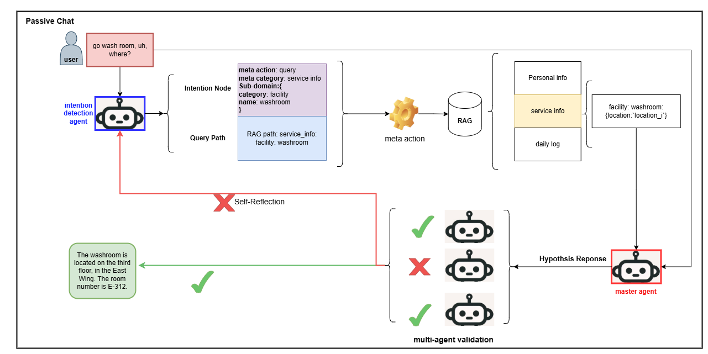
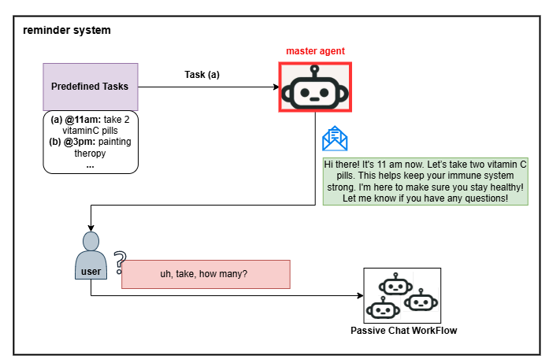

# Memoraid: A Virtual Assistant for Alzheimer’s Patients

**Memoraid** is a multi-agent virtual assistant designed to support individuals in the early to mid-stages of Alzheimer’s disease.  This project seeks to leverage the semantic understanding capabilities of LLMs to address challenges faced byAlzheimer’s patients. We propose an LLM-based multi-agent system enhanced with a dynamic personal profiling database to deliver personalized and effec tive support. This system aims to provide accurate, factual answers to common questions while assisting in managing daily routines with instructions, thereby reducing the caregiving burden.

## Features
- **Personalized Assistance**: Accurate responses tailored to the user’s condition.
- **Cost-effective Caregiving**: Aiming to reduce the burdon on caregiver with low cost.

---
## System structure:
Our system supports two types of patient interactions:
    – Passive: Patient initiates conversation to request information (i.e. details ofamenities of their care facility).
    – Proactive: The system proactively sends reminders based on a predefined schedule (i.e. prompting the patient to follow therapy routine)

---

## Demo
To experience the full capabilities of **Memoraid**, follow the setup instructions for both the **GUI** and the **ComfyUI** components.

### Setup Instructions

1. **[GUI Setup](GUI/)**
   - Includes the user interface (UI) and reminder system.
2. **[ComfyUI Setup](Supplementaries/)**
   - Enables passive interaction capabilities.

Both components must be set up correctly to access all features provided by the demo. 

---

## Repository Overview

This section provides an overview of the key folders and files in the repository, along with their purposes and contents.

- **Supplementaries**
   Implementation of passive interaction as an API.
   Contains prompts used for agents in the passive interaction system.
- **Scheduler**
   Implementation of proactive interaction.
   Includes prompts used for agents in this system.
- **GUI**
   Shiny implementation of the chat user interface.
- **Test_Data**
   Contains synthetic QA datasets and corresponding user profiles.
   Includes prompts used to generate the QA datasets.
- **eval_results**
   Results of the evaluation conducted on the QA datasets.

- **evaluation.ipynb**
   Jupyter notebook containing scripts for evaluating the system's performance.

------

